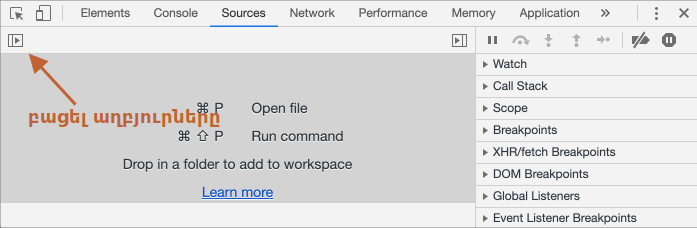
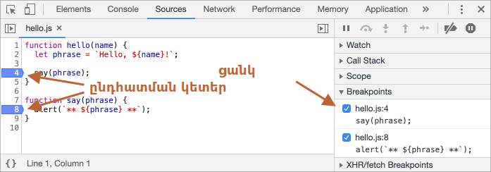
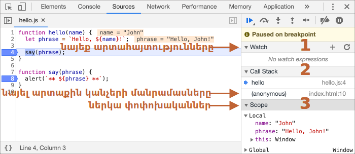
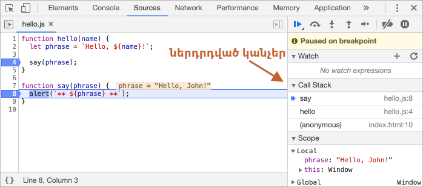

# Վրիպազերծում (debugging) զննիչում

Մինչև ավելի բարդ կոդ գրելը, եկեք խոսենք վրիպազերծման (debugging) մասին։

[Վրիպազերծումը](https://en.wikipedia.org/wiki/Debugging) սկրիպտում սխալները գտնելու և շտկելու գործընթացն է։ Բոլոր ժամանակակից զննիչները և շատ այլ միջավայրեր ունեն ներկառուցված վրիպազերծման գործիքներ (debugging tools)՝ հատուկ UI ծրագրավորման գործիքներում, որոնք զգալիորեն հեշտացնում են սխալների որոնումն ու վերլուծությունը։ Դրանք նաև թույլ են տալիս քայլ առ քայլ հետևել կոդի կատարմանը և հասկանալ, թե իրականում ինչ է տեղի ունենում։

Այս գլխում օգտագործելու ենք Chrome-ը, քանի որ այն ունի բավականին հարմար և հարուստ գործիքակազմ։ Սակայն մյուս զննիչների մեծ մասում գործընթացը շատ նման է։

## «Sources» վահանակը

Ձեր Chrome-ի տարբերակի տեսքը կարող է մի փոքր տարբերվել, սակայն հիմնական գաղափարը նույնն է լինելու։

- Բացեք [օրինակի էջը](debugging/index.html) Chrome-ում։
- Բացեք ծրագրավորողի գործիքները `key:F12` ստեղնով (Mac՝ `key:Cmd+Opt+I`)։
- Ընտրեք `Sources` վահանակը։

Առաջին անգամ բացելու դեպքում կտեսնեք մոտավորապես այսպիսի պատկեր՝



Անջատիչի կոճակը <span class="devtools" style="background-position:-172px -98px"></span> բացում է ֆայլերի ցանկը։

Այժմ ընտրեք `hello.js` ֆայլը։ Արդյունքում կտեսնեք հետևյալը՝


«Sources» վահանակը բաղկացած է երեք հիմնական հատվածից՝

1. **Ֆայլերի զննիչը (File Navigator)** ցուցադրում է էջին միացված HTML, JavaScript, CSS և այլ ֆայլերը, ինչպես նաև նկարները։ Chrome-ի extension-ները նույնպես կարող են երևալ այստեղ։
2. **Խմբագրիչի հատվածը (Editor)** ցույց է տալիս ընտրված ֆայլի ելակետային կոդը (source code)։
3. **JavaScript-ի վրիպազերծման հատվածը** նախատեսված է կոդի վերլուծության և քայլ առ քայլ կատարման համար։ Շուտով այն մանրամասն կքննարկենք։

Կարող եք կրկին սեղմել նույն անջատիչին <span class="devtools" style="background-position:-172px -122px"></span>, որպեսզի թաքցնեք ֆայլերի ցանկը և ավելի շատ տարածք տրամադրեք կոդին։

## Console (բարձակ)

Եթե սեղմենք `key:Esc`, ներքևում կբացվի բարձակը (`console`)։ Այնտեղ կարող ենք գրել հրամաններ և սեղմել `key:Enter`՝ դրանք կատարելու համար։

Հրամանի կատարումից հետո արդյունքը կցուցադրվի անմիջապես ներքևում։

Օրինակ՝ `1 + 2` արտահայտության արդյունքը կլինի `3`, իսկ `hello("debugger")` ֆունկցիայի կանչը ոչինչ չի վերադարձնում, ուստի արդյունքը կլինի `undefined`։


## Ընդհատման կետեր (breakpoints)

Եկեք տեսնենք, թե ինչ է տեղի ունենում [օրինակի էջի](debugging/index.html) կոդում։

`hello.js` ֆայլում սեղմեք `4`-րդ տողի համարի վրա։ Սեղմեք հենց տողի համարին, ոչ թե կոդին։

Շնորհավորում ենք․ դուք ստեղծեցիք ընդհատման կետ (breakpoint)։ Նույնը արեք նաև `8`-րդ տողի համար։

Արդյունքը պետք է լինի այսպիսին՝



**Ընդհատման կետը** կոդի այն հատվածն է, որտեղ debugger-ը ավտոմատ դադարեցնում է JavaScript-ի կատարումը։

Երբ կատարումը դադարեցված է, մենք կարող ենք՝

- ուսումնասիրել փոփոխականների արժեքները,
- կատարել հրամաններ console-ում,
- քայլ առ քայլ հետևել կոդի կատարմանը,
- հասկանալ, թե որտեղ է առաջացել խնդիրը։

Աջ վահանակում միշտ կարելի է տեսնել բոլոր ընդհատման կետերի ցանկը։ Դա հատկապես օգտակար է, երբ նախագծում կան բազմաթիվ breakpoints տարբեր ֆայլերում։ Այդ ցանկը թույլ է տալիս՝

- արագ անցնել համապատասխան breakpoint-ի մոտ,
- ժամանակավորապես անջատել breakpoint-ը,
- հեռացնել breakpoint-ը (`Remove`),
- և կատարել այլ գործողություններ։

```smart header="Պայմանական ընդհատման կետեր"
Տողի համարի վրա *աջ սեղմելով* կարող եք ստեղծել *պայմանական breakpoint*։ Այն կակտիվանա միայն այն դեպքում, երբ նշված պայմանը լինի true։

Սա օգտակար է, երբ ցանկանում ենք կանգնեցնել կատարումը միայն որոշակի փոփոխականի արժեքի կամ որոշակի պարամետրերի դեպքում։
```

## `debugger` հրամանը

Կարող ենք նաև ձեռքով կանգնեցնել կոդի կատարումը `debugger` հրամանով՝

```js
function hello(name) {
  let phrase = `Hello, ${name}!`;

*!*
  debugger; // debugger-ը կանգ կառնի այստեղ
*/!*

  say(phrase);
}
```

Այս հրամանն աշխատում է միայն այն դեպքում, երբ ծրագրավորողի գործիքները բաց են։ Հակառակ դեպքում զննիչը պարզապես անտեսում է այն։

## Դադարեցնել կատարումը և ուսումնասիրել կոդը

Մեր օրինակում `hello()` ֆունկցիան կանչվում է էջի բեռնման պահին, ուստի debugger-ը ակտիվացնելու ամենահեշտ ձևը էջը թարմացնելն է։

Սեղմեք `key:F5` (Windows/Linux) կամ `key:Cmd+R` (Mac)։

Քանի որ breakpoint-ը դրված է, կատարումը կդադարի `4`-րդ տողի վրա։



Այժմ բացեք աջ կողմում գտնվող տեղեկատվական բաժինները (նշված են սլաքներով)։ Դրանք թույլ են տալիս ուսումնասիրել կոդի ընթացիկ վիճակը։

### 1. `Watch`

Ցույց է տալիս ընտրված արտահայտությունների ընթացիկ արժեքները։

Կարող եք սեղմել `+` և ավելացնել ցանկացած արտահայտություն։ Debugger-ը ավտոմատ կվերահաշվի դրա արժեքը կոդի կատարման ընթացքում։

### 2. `Call Stack`

Ցույց է տալիս ֆունկցիաների կանչերի շղթան։

Տվյալ պահին debugger-ը գտնվում է `hello()` ֆունկցիայի ներսում, որը կանչվել է `index.html` սկրիպտից։

Եթե սեղմեք stack-ի որևէ տարրի վրա, debugger-ը կանցնի համապատասխան կոդի հատվածին և կցուցադրի դրա փոփոխականները։

### 3. `Scope`

Ցույց է տալիս ընթացիկ փոփոխականները։

- `Local` բաժնում ցուցադրվում են լոկալ փոփոխականները։
- `Global` բաժնում՝ գլոբալ փոփոխականները։

Այստեղ նաև կտեսնեք `this` keyword-ը, որի մասին դեռ կխոսենք հաջորդ գլուխներում։

## Քայլ առ քայլ կատարում

Այժմ ժամանակն է քայլ առ քայլ հետևելու սկրիպտի կատարմանը։

Վահանակի վերևում կան համապատասխան կոճակներ։ Դիտարկենք դրանցից հիմնականները։

<!-- https://github.com/ChromeDevTools/devtools-frontend/blob/master/front_end/Images/src/largeIcons.svg -->

<span class="devtools" style="background-position:-146px -168px"></span> -- `Resume`, կարճ ստեղն՝ `key:F8`
: Շարունակում է ծրագրի կատարումը։ Եթե այլ breakpoint չկա, debugger-ը կդադարի վերահսկել կատարումը։

    

    Այստեղ կատարումը հասել է հաջորդ breakpoint-ին՝ `say()` ֆունկցիայի ներսում։ Ուշադրություն դարձրեք `Call Stack` բաժնին․ այնտեղ ավելացել է նոր կանչ։

<span class="devtools" style="background-position:-200px -190px"></span> -- `Step`, կարճ ստեղն՝ `key:F9`
: Կատարում է հաջորդ հրահանգը։

    Եթե սեղմենք այս կոճակը, debugger-ը կանցնի հաջորդ տողին։ Կրկնվող սեղմումներով կարող ենք քայլ առ քայլ անցնել ամբողջ սկրիպտը։

<span class="devtools" style="background-position:-62px -192px"></span> -- `Step over`, կարճ ստեղն՝ `key:F10`
: Կատարում է հաջորդ հրահանգը, սակայն *չի մտնում ֆունկցիայի ներսը*։

    Եթե հաջորդ հրահանգը ֆունկցիայի կանչ է, `Step over`-ը կկատարի այն ամբողջությամբ և կդադարի հաջորդ տողի վրա։

    Սա հարմար է, երբ տվյալ ֆունկցիայի ներքին աշխատանքը մեզ չի հետաքրքրում։

<span class="devtools" style="background-position:-4px -194px"></span> -- `Step into`, կարճ ստեղն՝ `key:F11`
: Նման է `Step` հրամանին, սակայն աշխատում է նաև ասինխրոն կանչերի հետ։

    Եթե դեռ նոր եք սովորում JavaScript, այս տարբերությունը կարող եք անտեսել։

    Հետագայում, երբ աշխատեք `setTimeout`-ի կամ այլ ասինխրոն գործողությունների հետ, `Step into`-ը թույլ կտա մտնել նաև դրանց կատարման հոսքի մեջ։

<span class="devtools" style="background-position:-32px -194px"></span> -- `Step out`, կարճ ստեղն՝ `key:Shift+F11`
: Շարունակում է ընթացիկ ֆունկցիայի կատարումը մինչև դրա ավարտը։

    Սա օգտակար է, երբ պատահաբար մտել եք որևէ ֆունկցիայի ներս և ցանկանում եք արագ դուրս գալ այնտեղից։

<span class="devtools" style="background-position:-61px -74px"></span> -- Միացնել/անջատել բոլոր breakpoint-ները
: Միացնում կամ անջատում է բոլոր breakpoint-ները՝ առանց դրանք հեռացնելու։

<span class="devtools" style="background-position:-90px -146px"></span> -- Ավտոմատ կանգ սխալի դեպքում
: Եթե այս տարբերակը միացված է, debugger-ը ավտոմատ կդադարեցնի կատարումը ցանկացած սխալի դեպքում։

    Դա թույլ է տալիս անմիջապես տեսնել սխալի առաջացման վայրը և ուսումնասիրել փոփոխականների արժեքները։

```smart header="Continue to here"
Կոդի որևէ տողի վրա աջ սեղմելով կարող եք ընտրել `Continue to here` տարբերակը։

Debugger-ը կշարունակի կատարումը մինչև ընտրված տողը՝ առանց նոր breakpoint ստեղծելու։
```

## Լոգավորում

Կոդից console տեղեկատվություն արտածելու համար օգտագործվում է `console.log` ֆունկցիան։

Օրինակ՝

```js run
// արդյունքը տեսնելու համար բացեք console-ը
for (let i = 0; i < 5; i++) {
  console.log("value", i);
}
```

Այս կոդը console-ում կտպի `0`-ից մինչև `4` արժեքները։

Սովորական օգտատերերը չեն տեսնում console-ի արտածած տվյալները։ Դրանք հասանելի են միայն ծրագրավորողի գործիքներում։

Եթե կոդում բավարար logging ավելացնենք, հաճախ հնարավոր կլինի հասկանալ խնդիրը նույնիսկ առանց debugger-ի օգտագործման։

## Ամփոփում

JavaScript-ի կատարումը դադարեցնելու երեք հիմնական եղանակ կա՝

1. Breakpoint-ների միջոցով,
2. `debugger` հրամանով,
3. Սխալի առաջացման դեպքում (եթե DevTools-ը բաց է և համապատասխան տարբերակը միացված է)։

Երբ կատարումը դադարեցված է, կարող ենք՝

- ուսումնասիրել փոփոխականների արժեքները,
- հետևել կոդի կատարմանը,
- հասկանալ, թե որտեղ և ինչու է առաջացել խնդիրը։

Chrome DevTools-ը ունի շատ ավելի մեծ հնարավորություններ, քան ներկայացված է այս գլխում։ Լրիվ փաստաթղթավորումը կարող եք գտնել այստեղ՝

<https://developers.google.com/web/tools/chrome-devtools>

Այս գլխի տեղեկատվությունը բավարար է վրիպազերծումը սկսելու համար, սակայն եթե հաճախ եք աշխատում զննիչում, արժե ավելի խորությամբ ուսումնասիրել DevTools-ի հնարավորությունները։

Եվ վերջում՝ մի վախեցեք փորձարկել։ Սեղմեք տարբեր կոճակների վրա, բացեք համատեքստային մենյուները և ուսումնասիրեք DevTools-ի միջերեսը։ Դա այն սովորելու ամենաարագ ճանապարհներից մեկն է։

